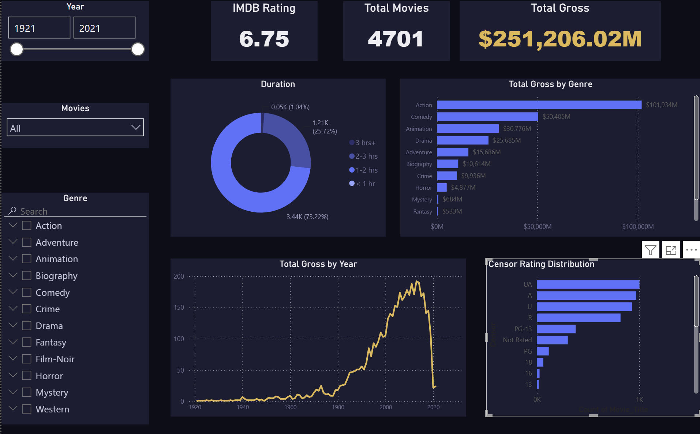

# 🎬 IMDB Movies Power BI Dashboard

An interactive Power BI dashboard analyzing 4,701 movies from an IMDB dataset that explores gross revenue, genre performance, duration trends, and censor ratings across more than a century of film (1921–2021).



## 📊 Overview

The dashboard lets users filter by year range, movie title, and genre, surfacing insights such as:

- **Total box office gross** across the full dataset, and how it breaks down by genre and by year
- **Average IMDB rating** and total movie count as headline KPIs
- **Runtime distribution**: share of movies by duration category
- **Censor rating breakdown**: how many movies fall into each certification tier (UA, A, U, R, PG-13, PG, Not Rated, 18)

## 🖥️ Key Visuals

| Visual | Description |
|---|---|
| KPI Cards | Avg IMDB Rating, Total Movies, Total Gross |
| Year Range Slider | Drag-to-filter across 1921–2021 |
| Movie / Genre Filters | Searchable dropdown and multi-select list |
| Duration Donut Chart | Movies grouped by runtime category |
| Total Gross by Genre (Bar) | Revenue ranked across genres |
| Total Gross by Year (Line) | Revenue trend over time |
| Censor Rating Distribution (Bar) | Movie count by certification, sorted descending |

## 🗂️ Repository Structure

```
├── MOVIE.pbix              # Power BI Desktop file (data model + report)
├── screenshots/
│   └── dashboard-overview.png  # Current dashboard preview image
├── README.md
└── .gitignore
```

## 🧱 Data Model & Fixes Applied

The source `imdb shows` table originally stored `Rating` and `Total_Gross` as text (e.g. `"6.7"` and `"$183.65M"`), which caused two visible bugs in the initial build: an IMDB Rating KPI stuck at `1.5` (an arbitrary "First" value instead of an average) and a Total Gross KPI showing `$0.00M` (text can't be summed).

**Fixes applied:**
- Converted `Rating` to Decimal Number in Power Query, enabling a real average
- Cleaned `Total_Gross` (stripped `$` and `M` characters) and converted to Decimal Number
- Added explicit DAX measures instead of relying on implicit column aggregations:
  ```dax
  Avg IMDB Rating = AVERAGE('imdb shows'[Rating])
  Total Gross = SUM('imdb shows'[Total_Gross])
  ```
- Switched the Total Gross by Genre measure from an implicit **Count** aggregation to the correct **Sum**, verified the genre bars now sum to within 0.03% of the Total Gross KPI

## 🎨 Design

The report uses a custom **cinematic navy** theme:

| Color | Hex | Role |
|---|---|---|
| 🟦 | `#0C0D18` | Page background |
| 🟦 | `#1B1D33` | Panel / card background |
| 🔵 | `#4C6FFF` | Primary accent (bars, donut) |
| 🟡 | `#E8B84B` | Secondary accent (Total Gross KPI, trend line) |
| ⚪ | `#EDEDF2` | Primary text |
| ⚪ | `#9A9CBE` | Muted / secondary text |

Other UX changes from the original build:
- Year filter converted from a scrollable checkbox list to a **range slider**
- Movie title filter converted to a **dropdown** to save vertical space
- Censor Rating chart converted from a pie (8 overlapping slice labels) to a **sorted horizontal bar chart** for legibility
- Total Gross by Year line chart corrected to read chronologically left-to-right

## 🚀 Getting Started

**Prerequisites:** [Power BI Desktop](https://powerbi.microsoft.com/desktop/) (free, Windows only)

1. Clone this repository
   ```bash
   git clone https://github.com/<your-username>/imdb-movies-power-bi-dashboard.git
   ```
2. Open `pbix/MOVIE.pbix` in Power BI Desktop
3. Refresh the data source if prompted (**Home → Refresh**)
4. Explore the report using the year slider and genre/movie filters

Don't have Power BI installed? View the static export in [`docs/dashboard-export.pdf`](docs/dashboard-export.pdf) or the screenshot above.

## 🛠️ Tech Stack

- **Power BI Desktop**: data modeling, DAX measures, report design
- **DAX**: calculated measures (gross totals, rating averages)
- **Power Query (M)**: data cleaning and type conversion

## 📈 Possible Next Steps

- [ ] Publish to Power BI Service and embed a live link here
- [ ] Add a data dictionary documenting each column and measure
- [ ] Add source dataset attribution / link
- [ ] Investigate `side_genre` field to decide between a flat multi-genre filter vs. the current main/side structure

## 📄 License

This project is shared under the [MIT License](LICENSE). The underlying movie dataset may carry its own license/attribution — update this section with the actual source (e.g. Kaggle IMDB dataset) and its terms.
